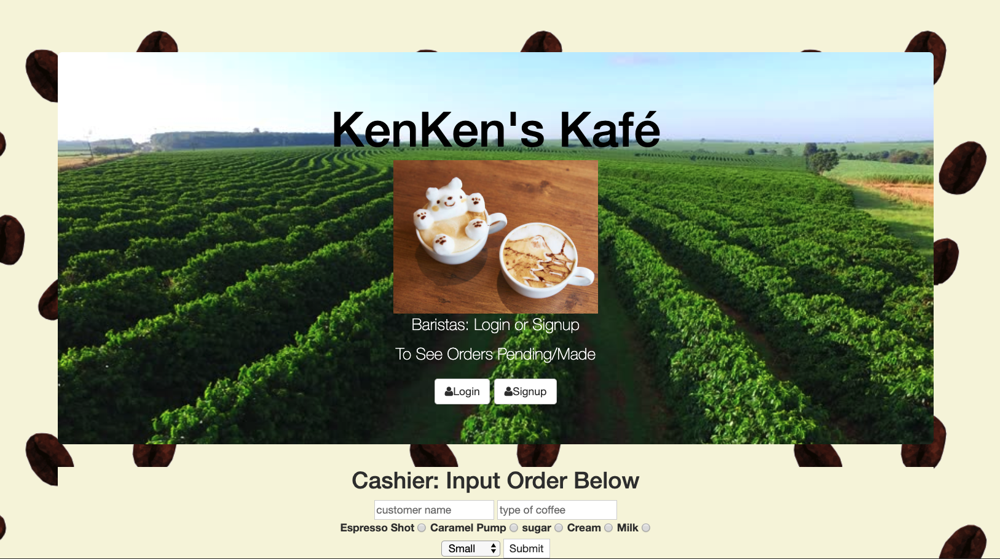

# Barista FullStack Application

The Goal of this project was to build an APP that a coffee shop cashier
could place an order in and a series of Baristas can log in to,
grab an order, and mark the order completed.

Additional Feature: Text to Speech is used to call out the customer's name
when the order is complete.

## How It's Made:
## Tech Used: HTML , CSS, JS, Node, MongoDB, Express
The project had a layout built using HTML/CSS with JS and Node/MongoDB on the backend.
Orders stored on a Mongo database and the retrieval uses Node.js

## Lessons Learned
This project allowed me to test the ability of entering form info into a
database and retrieving it to display on the DOM.

## Installation
1. Clone repo
2. run `npm install`

## Usage

1. run `node server.js`
2. Navigate to `localhost:8080`

## Logging into the Sample
1. username: demo
2. password: demo
